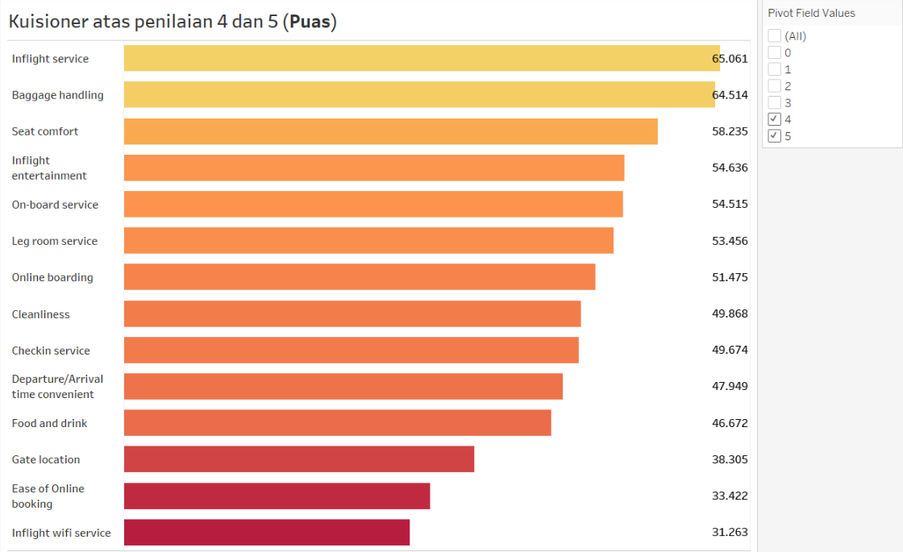
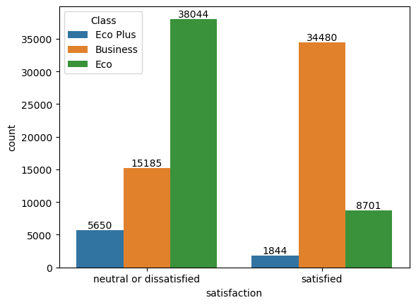
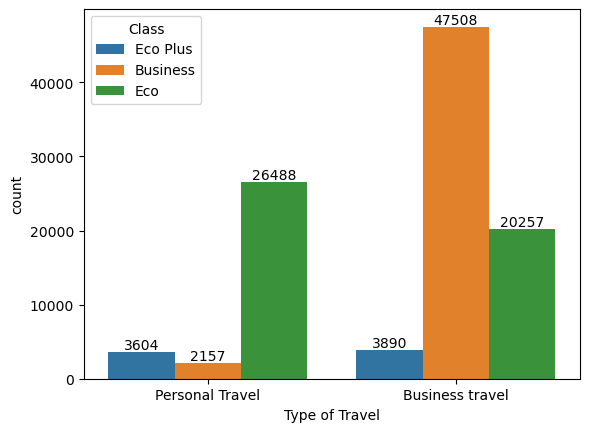

✈️ Airline Passenger Satisfaction Analysis

End-to-End Data Analysis & Classification Project

📌 Project Overview

Industri penerbangan adalah industri dengan kompetisi tinggi, margin ketat, dan ekspektasi pelanggan yang terus meningkat.

Project ini bertujuan untuk:

- Mengidentifikasi faktor utama yang mempengaruhi kepuasan penumpang
- Membangun model prediktif untuk mengklasifikasikan tingkat kepuasan
- Memberikan rekomendasi bisnis berbasis data untuk meningkatkan customer experience

Project ini dirancang sebagai portfolio untuk posisi Data Analyst / Business Intelligence Analyst, sekaligus sebagai demonstrasi kemampuan end-to-end data workflow — dari data cleaning hingga business recommendation.

🎯 Business Objective
Maskapai perlu menjawab pertanyaan strategis berikut:

- Faktor layanan apa yang paling memengaruhi kepuasan pelanggan?
- Apakah terdapat perbedaan kepuasan berdasarkan kelas penerbangan dan jenis perjalanan?
- Seberapa akurat model machine learning dalam memprediksi kepuasan pelanggan?

Tujuan akhirnya adalah membantu manajemen memprioritaskan investasi layanan yang paling berdampak terhadap kepuasan pelanggan.

🧠 About Me
Saya adalah career switcher yang berfokus membangun karier sebagai Data Analyst / Data Engineering Enthusiast.
Saya memiliki pengalaman dalam:

- Membersihkan dan mempersiapkan data
- Melakukan exploratory data analysis (EDA)
- Membangun model klasifikasi
- Menerjemahkan hasil analisis menjadi insight yang actionable untuk bisnis

Saya percaya bahwa data bukan hanya angka, tetapi alat untuk membantu perusahaan mengambil keputusan yang lebih tepat dan terukur.

🛠 Skills & Tools
Programming:

- Python
- SQL

Libraries:

- pandas
- numpy
- matplotlib
- seaborn
- scikit-learn

Technical Skills:

- Data Cleaning & Preprocessing
- Exploratory Data Analysis (EDA)
- Feature Engineering
- Classification Modeling (KNN, Decision Tree)
- Model Evaluation (Accuracy, F1-Score, Confusion Matrix)

Data Visualization

📊 Dataset

- Source: https://www.kaggle.com/code/andybrandycandy/airline-passenger-satisfaction
- Jumlah Data: 103,904 rows
- Jumlah Kolom: 25 features
- Tipe Data: Campuran (numerical & categorical)
- Isi Data: Survei kepuasan pelanggan maskapai penerbangan

🔍 Data Preparation

1️⃣ Data Cleaning
- Menghapus kolom tidak relevan: Unnamed: 0, id
- Menghapus kolom delay untuk menyederhanakan analisis
- Memastikan tidak ada missing value pada dataset final

2️⃣ Feature Engineering
- Membuat fitur age_group (0–12, 13–37, 38–85)
- Menghapus kolom Age asli
- Encoding fitur kategorikal menggunakan Label Encoding

3️⃣ Train-Test Split
- 80% Training Set
- 20% Test Set

📈 Exploratory Data Analysis (EDA)
Beberapa analisis utama yang dilakukan:
🔹 Distribusi Kepuasan
Sebagian besar penumpang masih berada dalam kategori neutral atau dissatisfied, menunjukkan adanya ruang besar untuk perbaikan layanan.
🔹 Analisis Demografi
Perbedaan kepuasan signifikan berdasarkan:
- Class (Business vs Eco)
- Type of Travel (Business vs Personal)

🔹 Faktor Layanan yang Berpengaruh
Layanan dengan korelasi tinggi terhadap kepuasan:
- Seat comfort
- Online boarding
- Inflight entertainment
- Cleanliness

Layanan dengan tingkat ketidakpuasan tinggi:
- Inflight wifi service
- Ease of online booking

🤖 Machine Learning Modeling

🔹 K-Nearest Neighbors (KNN)
- n_neighbors = 3
- Accuracy: 0.8600
- F1-Score: 0.8329

🔹 Decision Tree Classifier (Default)
- Accuracy: 0.9469
- F1-Score: 0.9393

🔹 Decision Tree (Tuned)
- criterion = entropy
- max_depth = 5
- Accuracy: 0.9051
- F1-Score: 0.8908

📌 Kesimpulan:

Decision Tree memberikan performa terbaik dan juga interpretabilitas tinggi untuk memahami faktor yang memengaruhi kepuasan.

💡 Key Insights

- Kenyamanan kursi dan kemudahan digital adalah driver utama kepuasan.
- Penumpang Business Class memiliki tingkat kepuasan jauh lebih tinggi.
- Layanan digital (wifi & online booking) adalah titik lemah utama.
- Model Decision Tree mampu memprediksi kepuasan dengan akurasi tinggi (>94%).

🚀 Business Recommendations
Berdasarkan analisis:

1️⃣ Fokus pada Digital Experience
- Tingkatkan stabilitas dan kualitas inflight WiFi
- Optimasi sistem online booking dan boarding

2️⃣ Re-evaluasi Eco Plus
- Dengan kontribusi penumpang hanya ~7%, evaluasi profitabilitas kelas ini dan pertimbangkan realokasi resource.

3️⃣ Tingkatkan Service di Economy Class
- Karena volume penumpang terbesar ada di Eco, peningkatan kecil di kelas ini bisa berdampak besar terhadap overall satisfaction.

4️⃣ Optimasi Desain Kuesioner
- Hilangkan nilai netral (3) untuk insight lebih tegas
- Hindari pengisian untuk anak usia 5–12 tahun guna mengurangi bias
- Jadikan pengisian survey mandatory untuk meningkatkan kualitas data

🧩 Why This Project Matters

Project ini menunjukkan kemampuan saya dalam:

✔ Mengelola proyek data secara end-to-end
✔ Mengubah data mentah menjadi insight strategis
✔ Menghubungkan analisis teknis dengan dampak bisnis
✔ Membangun model prediktif yang interpretatif

📌 Final Takeaway

- Customer satisfaction bukan hanya tentang layanan terbaik, tetapi tentang mengetahui layanan mana yang paling berdampak terhadap loyalitas pelanggan. Dengan pendekatan berbasis data, maskapai dapat:
- Mengoptimalkan investasi layanan
- Meningkatkan retensi pelanggan
- Mengambil keputusan yang lebih terukur

Untuk Ppt presentasinya dapat di lihat pada halaman berikut https://heyzine.com/flip-book/0f5953ea5e
Reach me on my Linkedin here https://www.linkedin.com/in/abiyasapanatagama/ 
